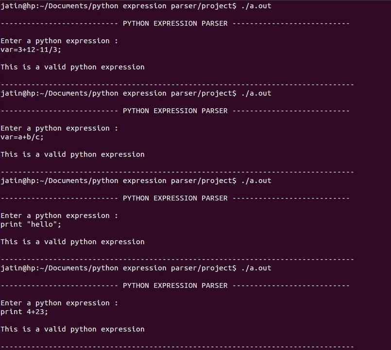
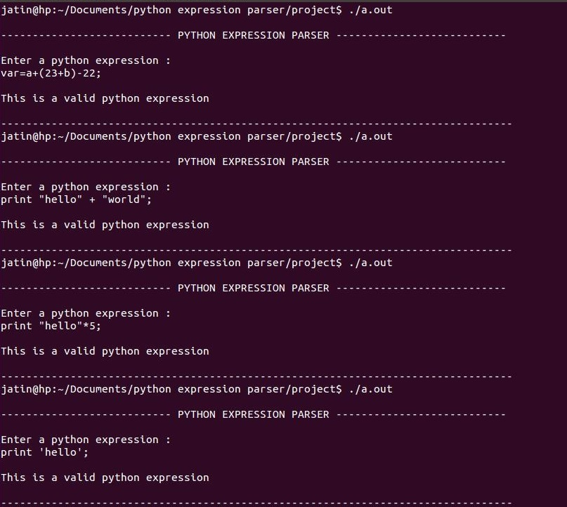
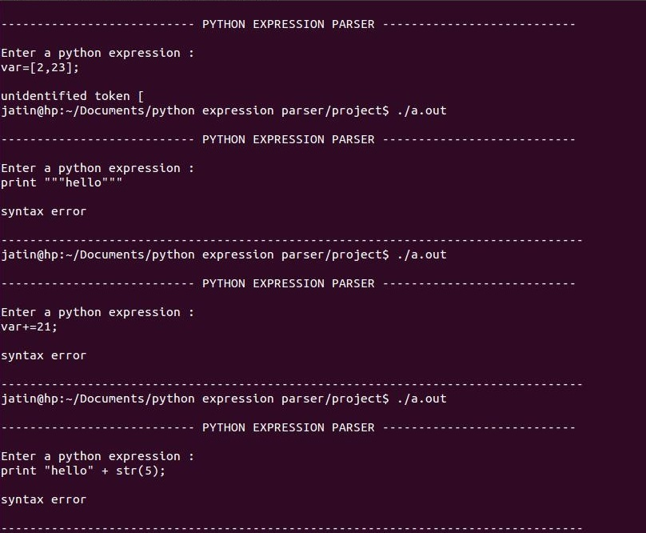

# Python parser

A simple parser for python made using lex yacc / [GNU's flex bison](https://www.gnu.org/software/bison/manual/).

The stable version currently supports only certain python expressions as stated below. The code for the same is in `python-expression-parser` directory. A similarly made python for-loop parser can also be found in the `python-loop-parser` directory.

## Screenshots





## How to make

- The following packages are required
  + gnu's lex yacc `sudo apt-get install bison flex`
  + make utility `sudo apt-get install build-essential`
- go to source folder `cd python-expression-parser`
- `make clean` to remove old stuff lying around
- `make` to build : this will generate the usual files
- `make run` to execute or simply run `./expression-parser`

## How to debug

- go to source folder `cd python-expression-parser`
- `make clean` to remove old stuff lying around
- `make debug` to build with debugging flags. This will generate a lot of extra files. Browse them to know more about them.
- run `./debug-expression-parser`

## Challenges

- Program works when input in only a single line.
  - It can be made into consecutive multiple line input using  `BEGIN <stmt-list> END`.
  - But then, when a syntax error is encountered,
    - i will have to handle the error,
    - empty the current stack 
    - then recover from the error
    - and then keep the program going until statements are over

- One program run parses only one statement. 
  - It can be made for infinite statements.
  - That is, continous INPUT_OUTPUT stream until ctrl+c on terminal can be achieved.
  - This can be done by removing `return 0;` from the success case.
  - In this case as well, the current stack needs to be emptied.

## Assumptions

- each statement ends with semicolon

## Cases Handled

- arithmetic expressions along with brackets
    ```python
	a=5;
	a=5+24;
	a=rod;
	a=5*(4+3);
    ```

- string assignments
    ```python
 	var="hello";
	var='hello';
    ```

- print statements
	```python
    print 'hello';		# single quotes handled
	print "hello";		# double quotes handled
    ```

- keywords cant be identifiers

## Cases not handled

- Multiple Statements on a Single Line 
    ```python
    var=5; var2=6; var7=23;
    ```

- multi line statements -- a single statement written in multiple lines
    ```python
    var= 2+ \
        3+	\
        4
    ```

- static array initialisation not included  
    ```python
    var = [3,3,23];
    days = ['Monday', 'Tuesday', 'Wednesday','Thursday', 'Friday']
    ```

- single or multi line comments

- triple quote print statements - multiline strings
    ```
	print """hello""";
	print '''hello''';
    ```

- typecasting
    ```python
    print "hello" + str(5);
    ```

- shorthand operators not handled
    ```python
    var+=3;
    var+=2;
    ```

## Disclaimer

- This assignment covers only simple cases.
- Only to be used as a reference point.
- This code was made in 2015. Use at your own discretion.

## Reference links

- Lex Yacc Introduction 
  - [http://epaperpress.com/lexandyacc/intro.html](http://epaperpress.com/lexandyacc/intro.html)
  - [http://dinosaur.compilertools.net/lex/](http://dinosaur.compilertools.net/lex/)
  - [http://dinosaur.compilertools.net/yacc/](http://dinosaur.compilertools.net/yacc/)

- Lex yacc primer
  - [http://tldp.org/HOWTO/Lex-YACC-HOWTO-7.html](http://tldp.org/HOWTO/Lex-YACC-HOWTO-7.html)

- Bison manual references
  - [http://www.gnu.org/software/bison/manual/html_node/Understanding.html](http://www.gnu.org/software/bison/manual/html_node/Understanding.html)
  - [http://www.gnu.org/software/bison/manual/bison.html#Action-Features](http://www.gnu.org/software/bison/manual/bison.html#Action-Features)
  - [http://www.gnu.org/software/bison/manual/bison.html#Algorithm](http://www.gnu.org/software/bison/manual/bison.html#Algorithm)
  - [http://www.gnu.org/software/bison/manual/html_node/Error-Recovery.html](http://www.gnu.org/software/bison/manual/html_node/Error-Recovery.html)

- Python expressions 
  - [http://www.tutorialspoint.com/python/python_loop_control.htm](http://www.tutorialspoint.com/python/python_loop_control.htm)
  - [http://www.tutorialspoint.com/python/python_basic_syntax.htm](http://www.tutorialspoint.com/python/python_basic_syntax.htm)
  - [https://docs.python.org/2/reference/expressions.html](https://docs.python.org/2/reference/expressions.html)
